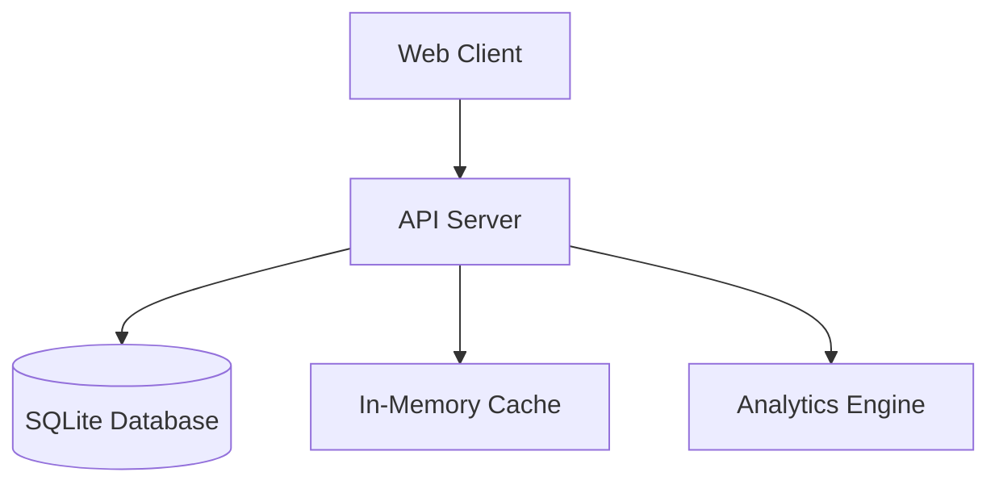

contine# Technical Design Document

## System Architecture

### Overview


### Core Components
1. API Server (Go/Gin)
   - Request handling
   - Business logic
   - Data access
   - Cache management

2. Database (SQLite)
   - Data persistence
   - ACID compliance
   - Transaction management

3. Cache Layer
   - In-memory caching
   - Response caching
   - Session data

4. Analytics Engine
   - Progress tracking
   - Performance metrics
   - Learning analytics

## Database Design

### Schema Overview
[Detailed schema from original spec]

### Data Access Patterns
1. Read Patterns
   - Word lookups
   - Study session retrieval
   - Progress queries

2. Write Patterns
   - Session recording
   - Progress updates
   - Word management

## Integration Points

### Internal Services
1. Study Session Manager
   - Session creation
   - Progress tracking
   - Timeout handling

2. Word Management Service
   - CRUD operations
   - Group management
   - Tag management

3. Analytics Service
   - Data collection
   - Metric calculation
   - Report generation

### Development Roadmap

#### Phase 1 (Weeks 1-2)
- Project structure setup
- Database implementation
- Basic API framework
- Core CRUD operations

#### Phase 2 (Weeks 3-4)
- Study session implementation
- Word management features
- Basic progress tracking
- Initial testing framework

[Continue with subsequent phases...]

## Error Handling and Monitoring

The application implements a comprehensive error handling and monitoring system:

### Error Handling
- Custom error types with error codes and additional context
- Consistent error wrapping throughout the application
- HTTP status code mapping based on error types
- Structured error responses in API endpoints

### Monitoring
- Prometheus metrics for request counters and latency histograms
- Transaction success/failure monitoring
- Handler-level performance tracking
- Database connection pool metrics

### Context Support
- Context propagation throughout the application stack
- Request cancellation handling
- Timeout management
- Request-scoped logging

## Database Operations

### Transaction Support
- Atomic operations for multi-step processes
- Automatic rollback on errors
- Context-aware transaction handling
- Performance monitoring for transactions

### Connection Management
- Connection pooling with configurable limits
- Health checking with automatic recovery
- Connection lifetime management
- Idle connection cleanup

## API Design

### Request Flow
1. Request received by handler
2. Context and metrics initialized
3. Input validation
4. Service layer processing
5. Database operations (with transaction if needed)
6. Response formatting
7. Metrics updated

### Error Response Format
```json
{
  "error": {
    "code": "ERROR_CODE",
    "message": "Human readable message",
    "details": {} // Optional additional information
  }
}
```

## Metrics

### Handler Metrics
- Request count (success/error)
- Request duration
- Request size
- Response time

### Database Metrics
- Transaction success/failure rate
- Query execution time
- Connection pool status
- Error rate by type

## Configuration

### Environment Variables
- Database connection settings
- Server timeouts
- Logging levels
- Metrics collection intervals

### Health Checks
- Database connectivity
- Connection pool status
- System resource usage
- Response time monitoring

## Monitoring and Observability

### Metrics System
The application uses Prometheus for metrics collection with the following components:

1. Metric Types
   - Counters: For request counts, errors
   - Histograms: For latency measurements
   - Gauges: For resource utilization

2. Custom Metrics
   ```go
   type Metrics struct {
       requestCount    *prometheus.CounterVec
       requestDuration *prometheus.HistogramVec
       errorCount     *prometheus.CounterVec
       dbConnections  *prometheus.GaugeVec
   }
   ```

3. Integration Points
   - HTTP handlers
   - Database operations
   - External service calls
   - Resource utilization

### Performance Requirements

1. Latency Targets
   - p95 < 200ms
   - p99 < 500ms
   - Maximum < 1s

2. Throughput
   - 100 req/s per instance
   - Linear scaling
   - Max 1000 concurrent users

3. Resource Utilization
   - CPU: < 70%
   - Memory: < 80%
   - DB Connections: < 90%

### Alerting Strategy

1. Critical Alerts
   - Service availability
   - Data integrity
   - Security incidents

2. Warning Alerts
   - Performance degradation
   - Resource pressure
   - Error rate increase

3. Alert Routing
   - Slack integration
   - Email notifications
   - PagerDuty escalation

### Monitoring Infrastructure

1. Components
   - Prometheus
   - Grafana
   - AlertManager
   - Log aggregation

2. Data Retention
   - Metrics: 30 days
   - Logs: 90 days
   - Alerts: 180 days

3. Scaling Considerations
   - Metric cardinality
   - Storage requirements
   - Query performance 